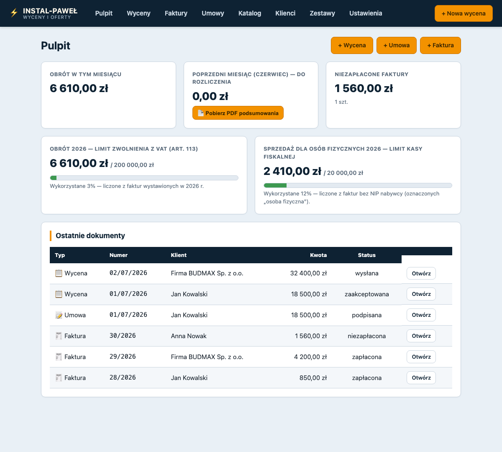
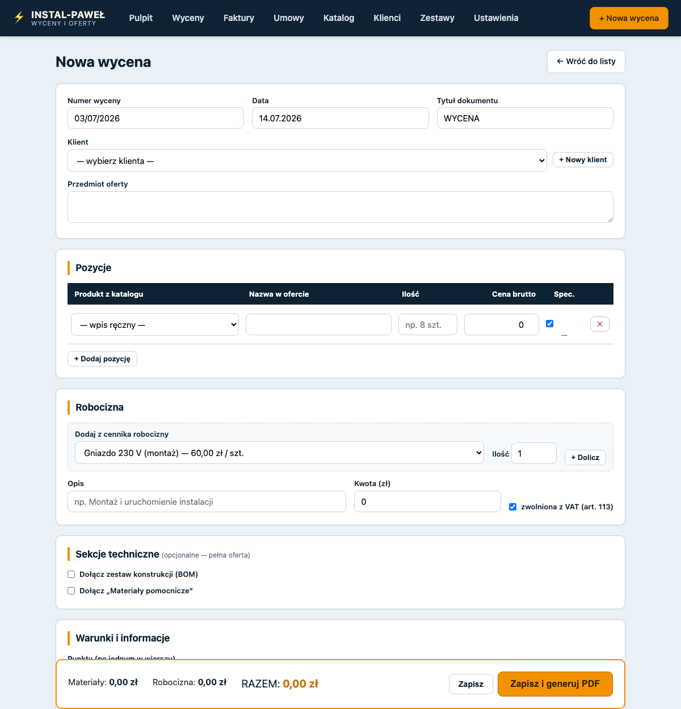
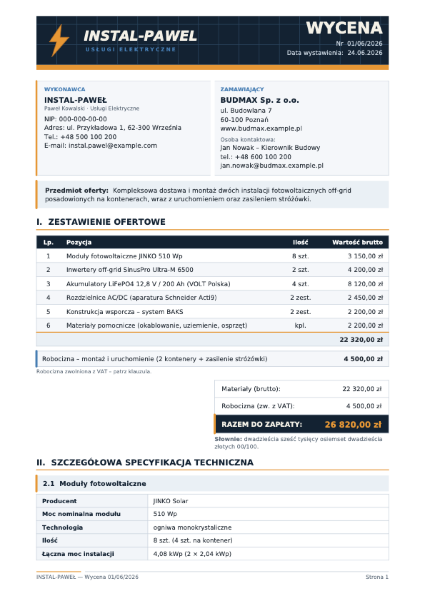
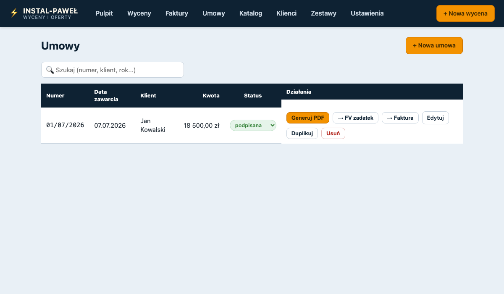
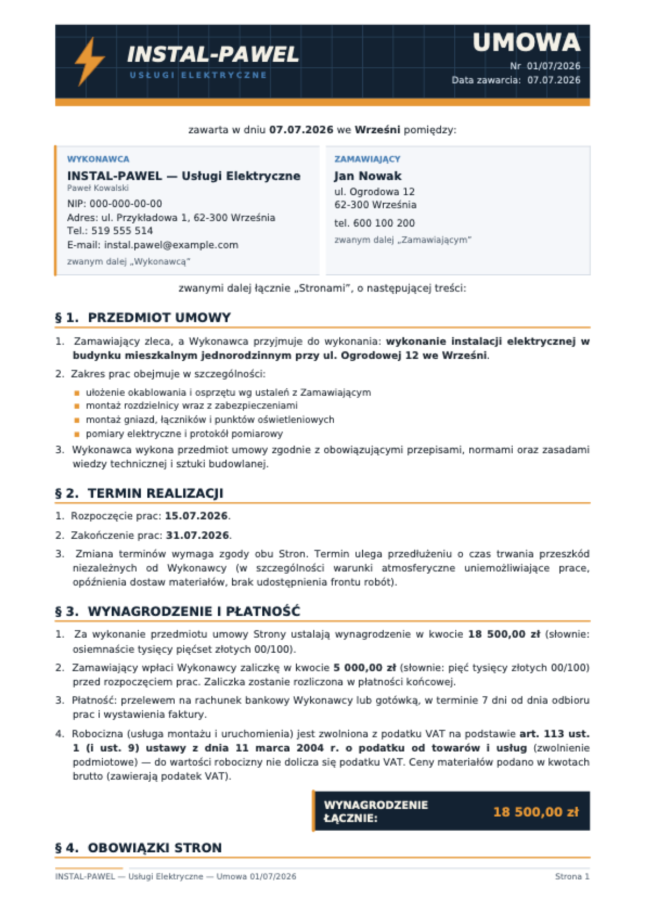
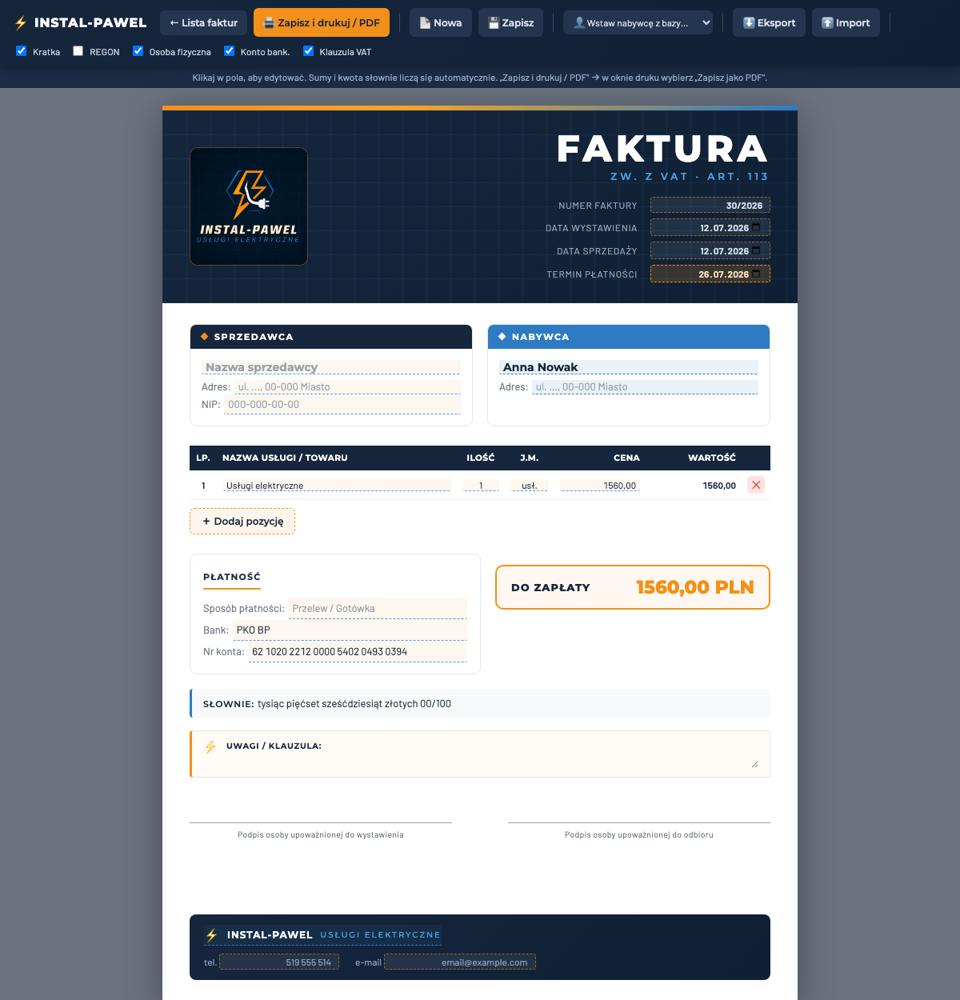

# ⚡ INSTAL-PAWEŁ — wyceny, umowy i faktury dla firmy elektrycznej

Prosta aplikacja desktopowa (lokalny serwer Flask + przeglądarka), w której elektryk **bez
wiedzy technicznej** w kilka minut tworzy profesjonalne dokumenty PDF w spójnej szacie
graficznej marki INSTAL-PAWEŁ:

- **Wyceny / oferty** — od krótkiej jednostronicowej wyceny po pełną ofertę techniczną
  ze specyfikacjami i wykazem konstrukcji,
- **Umowy** o wykonanie prac (z zaliczką lub zadatkiem na materiał),
- **Faktury** (sprzedawca zwolniony z VAT, art. 113),
- **Zestawienia miesięczne** sprzedaży do rozliczeń.

Wszystko działa **lokalnie i offline** — bez chmury, bez logowania, bez kont. Dane trzymane
są w jednym pliku SQLite (`dane.db`).

## Pulpit

Obrót w miesiącu, licznik limitu zwolnienia z VAT (200 000 zł, art. 113) i limitu kasy
fiskalnej dla osób fizycznych (20 000 zł), niezapłacone faktury i ostatnie dokumenty:



## Wyceny

Edytor wyceny: klient z bazy, pozycje z katalogu produktów (autouzupełnianie cen
i specyfikacji technicznych), cennik robocizny, zestawy konstrukcji (BOM) z mnożnikiem,
suma liczona na żywo:



Wygenerowany PDF (dane przykładowe):



## Umowy

Umowa o wykonanie prac elektrycznych: przedmiot, zakres, terminy, wynagrodzenie
z opcjonalną **zaliczką lub zadatkiem na materiał** (art. 394 KC) i krótkim opisem.
Z umowy jednym kliknięciem powstaje faktura zaliczkowa/na zadatek oraz faktura końcowa
(pomniejszona o przedpłatę):





## Faktury

Edytor WYSIWYG — to, co widać na ekranie, jest drukowane 1:1 do PDF. Kwota słownie
i sumy liczą się same, bank i numer konta wstawiają się z Ustawień (przy płatności
gotówką sekcja banku znika), długie nazwy i adresy zawijają się automatycznie:



## Funkcje

| Moduł | Co robi |
|---|---|
| **Katalog produktów** | materiały i cennik robocizny z cenami i specyfikacjami technicznymi |
| **Klienci** | baza klientów wstawiana do wycen, umów i faktur |
| **Zestawy (BOM)** | gotowe wykazy elementów (np. konstrukcja BAKS) dodawane z mnożnikiem ×N |
| **Wyceny** | edytor + PDF, statusy (szkic/wysłana/zaakceptowana), duplikowanie, wycena → umowa/faktura |
| **Umowy** | edytor + PDF, zaliczka/zadatek, umowa → faktury |
| **Faktury** | edytor WYSIWYG + druk do PDF, statusy płatności, licznik limitu kasy fiskalnej |
| **Zestawienia** | miesięczne zestawienie sprzedaży PDF (rozbicie firmy / osoby fizyczne) |
| **Aktualizacje** | aplikacja sama pobiera nowe wersje z brancha `stable` (Ustawienia → Aktualizacje) |
| **Kopie zapasowe** | automatyczna kopia bazy przy starcie + ręczna z Ustawień |

## Logika VAT

- **Materiały** — ceny brutto (zawierają VAT).
- **Robocizna** — zwolniona z VAT na podstawie **art. 113 ust. 1 ustawy o VAT**
  (zwolnienie podmiotowe); klauzula trafia automatycznie na dokumenty.
- Suma = materiały (brutto) + robocizna; kwoty słownie liczy silnik PDF.

## Uruchomienie

Wymagany Python 3.10+. Pierwsze uruchomienie tworzy środowisko, instaluje zależności
i otwiera przeglądarkę na `http://127.0.0.1:8000`:

- **macOS** — dwuklik na `start.command`
- **Windows** — dwuklik na `start.bat`

Ręcznie:

```bash
python -m venv .venv && source .venv/bin/activate   # Windows: .venv\Scripts\activate
pip install -r pdf_engine/requirements.txt -r requirements.txt
python app.py                                        # http://127.0.0.1:8000
```

Podgląd samych silników PDF na danych przykładowych:

```bash
python pdf_engine/generator.py    # przyklad_oferta.pdf
python -m pdf_engine.umowa        # przyklad_umowa.pdf
```

## Stack

- **Python + Flask** — lekki lokalny serwer, szablony Jinja2, czysty JavaScript
  (bez frameworków i build-stepu),
- **SQLite** — jeden plik `dane.db` (klienci, katalog, zestawy, wyceny, umowy, faktury,
  ustawienia),
- **reportlab** — silniki PDF (`pdf_engine/`) z fontami DejaVu (polskie znaki),
- faktura drukowana z przeglądarki (HTML/CSS 1:1 z projektem graficznym).

## Struktura

```
app.py                 # aplikacja Flask (widoki, API)
db.py                  # schemat SQLite + migracje + dane startowe
pdf_service.py         # ścieżki zapisu i wywołania silników PDF
updater.py             # samoaktualizacja z GitHuba (branch stable)
pdf_engine/
  generator.py         # PDF wyceny/oferty
  umowa.py             # PDF umowy
  zestawienie.py       # PDF zestawienia miesięcznego
templates/ static/     # UI aplikacji + edytor faktury
```

## Wydania

Praca bieżąca na `main`. Wydanie dla użytkownika: podbicie wersji w `wersja.txt`
i `git push origin main main:stable` — aplikacja sama zaproponuje aktualizację
(pobiera ZIP przez HTTPS, nigdy nie rusza `dane.db`).
